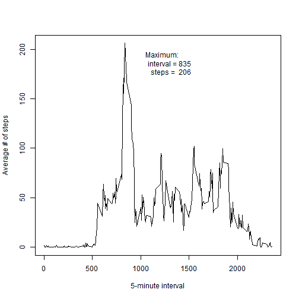

## Loading and preprocessing the data

First unzip and load the data


```r
     connection <- unz ("activity.zip","activity.csv")
     dat <- read.csv(connection)
```

Now check the structure of the table


```r
     summary(dat)
```

```
##      steps                date          interval     
##  Min.   :  0.00   2012-10-01:  288   Min.   :   0.0  
##  1st Qu.:  0.00   2012-10-02:  288   1st Qu.: 588.8  
##  Median :  0.00   2012-10-03:  288   Median :1177.5  
##  Mean   : 37.38   2012-10-04:  288   Mean   :1177.5  
##  3rd Qu.: 12.00   2012-10-05:  288   3rd Qu.:1766.2  
##  Max.   :806.00   2012-10-06:  288   Max.   :2355.0  
##  NA's   :2304     (Other)   :15840
```

The dates are factors rather than date variables; I'll convert them to dates so that I can use the weekday/weekend function later.


```r
     dat$newdate <- as.Date(dat$date, "%Y-%m-%d")
```

## What is mean total number of steps taken per day?  

**1.Make a histogram of the total number of steps each day**  

Calculate the total daily steps using the tapply function and plot a histogram.  The instructions say that the NA values can be ignored, so let's be explicit in removing them.


```r
dailySteps <- tapply(dat$steps,dat$date, sum, na.rm = T) 
hist(dailySteps)
myMean <- mean(dailySteps, na.rm = T)
myMedian <- median(dailySteps, na.rm = T)
#boxplot(dailySteps, ylab = ("Average daily steps"))
legend("topleft", legend = c(
            paste("Median =",format(myMedian, digits = 6)),
            paste("   Mean =", format(myMean, digits = 6))),
       bty = "n", cex = 0.75)
```

 


**2. Calculate and report the mean and median total steps per day**  


To find the mean and median steps per day, use built in R functions on the dailySteps variable.  To report in an interesting way, I've just annotated the histogram.


## What is the average daily activity pattern?

**1. Make a time series plot of the average number of steps taken within each five minute interval window.**  

First, use tapply again to calculate the averages for each time interval (this is *intervalSteps*). Then plot with base graphics package and annotate the maximum value.  

To figure out which interval has the maximum value, use the which.max function.  This will give an index, to get the right label, use the index on the names of the intervalSteps value.


```r
intervalSteps <- tapply(dat$steps, dat$interval, mean, na.rm = "T")

plot(x = as.numeric(names(intervalSteps)), y = intervalSteps, type = "l", 
     xlab = "5-minute interval", ylab = "Average # of steps")
myMaxSteps <- max(intervalSteps)
myMaxVal <- names(intervalSteps)[which.max(intervalSteps)]
text(x = as.numeric(myMaxVal) + 400, y = max(intervalSteps)-20, 
     label = paste("Maximum: \n        interval =", myMaxVal, "\n         steps = ", format(myMaxSteps, digits = 3)))
```

 

**2. Which 5-minute interval contains the maximum number of steps**

As shown in the plot above, the maximum average number of steps (206) occur at interval number 835.

## Imputing missing values

**1.How many missing values are in the dataset?**

From the summary above, there are 2304 missing values.  To find where these are, I summarize the steps variable and see that all the missing values are in this column.


```r
summary(dat$steps)
```

```
##    Min. 1st Qu.  Median    Mean 3rd Qu.    Max.    NA's 
##    0.00    0.00    0.00   37.38   12.00  806.00    2304
```

**2.Fill the missing values in the data set**

I decided to use the mean value for each interval to fill in the missing values since it makes sense to me that activity levels vary based on the time of day.  This will affect the later analysis of differences between weekend and weekday days, but since the NA values do not appear to be regularly spaced I think that the bias will be minimal.


```r
fill.na <- function(data, interval, intervalMeans) {
     if(is.na(data)){
          return (intervalMeans[which(names(intervalMeans) == interval)])
     } else {
          return (data)
     }
}

dat$newsteps <- mapply(fill.na, dat$steps, dat$interval, MoreArgs = list(intervalMeans = intervalSteps))
plot(dat$steps, type = "p", xlab = "Time", ylab = "Steps")
lines(dat$newsteps, col = "red", type = "l" )
```

 
  
  
**3.Create a new data set equal to the original but with the missing values filled in**  
As a general rule, I like avoiding duplicating data.  As a result, I just added a new column to my existing data frame.  

**4.Make a histogram of the total number of steps taken each day.  Report the mean and median.**

Here I just reuse the code block from above, changing a few variable names


```r
dailySteps2 <- tapply(dat$newsteps,dat$date, sum, na.rm = T) 
hist(dailySteps2)
myMean2 <- mean(dailySteps2, na.rm = T)
myMedian2 <- median(dailySteps2, na.rm = T)
#boxplot(dailySteps, ylab = ("Average daily steps"))
legend("topleft", legend = c(
            paste("Median =",format(myMedian2, digits = 6)),
            paste("   Mean =", format(myMean2, digits = 6))),
       bty = "n", cex = 0.75)
```

 
  
  
  
  
**5.How does imputing missing data alter these estimates?**  

The original mean and median were 9354 and 10395 respectively while the new values are 10766 and 10766.

## Are there differences in activity patterns between weekdays and weekends?  

**1. Create a factor that contains two levels: weekday and weekend**  

The weekdays function will take a date and tell me what day of the week that date corresponds to.  I'll take each unique date, and use weekdays to figure out what day this is. I'll instantiate a character vector of all "weekday", change the weekend days to "weekend" based on the results of the weekdays function, and then convert the character vector to a factor.


```r
     uniqueDates <- unique(dat$newdate) 
     days <- weekdays(uniqueDates)
     dayType <- rep("weekday",length(days))
     dayType[which((days == "Saturday") | (days == "Sunday"))] = "weekend"
     dayType <- factor(dayType, levels = c("weekday", "weekend"))
     summary(dayType)
```

```
## weekday weekend 
##      45      16
```


**2. Create a panel plot showing the time series of the average steps per day for weekends and weekdays separately.**  


```r
     par(mfrow=c(2,1), mar = c(2,4,3,1))
     
     plot(uniqueDates[dayType == "weekday"], dailySteps[dayType == "weekday"], ylab = "Steps", xlab = "", type = "l", main = "Weekdays",  xlim = c(min(uniqueDates), max(uniqueDates)), ylim = c(min(dailySteps), max(dailySteps)))
     par(mar = c(2,4,3,1))
     plot(uniqueDates[dayType == "weekend"], dailySteps[dayType == "weekend"], ylab = "Steps", xlab = "", type = "l", main = "Weekend", xlim = c(min(uniqueDates), max(uniqueDates)), ylim = c(min(dailySteps), max(dailySteps)))
```

 
